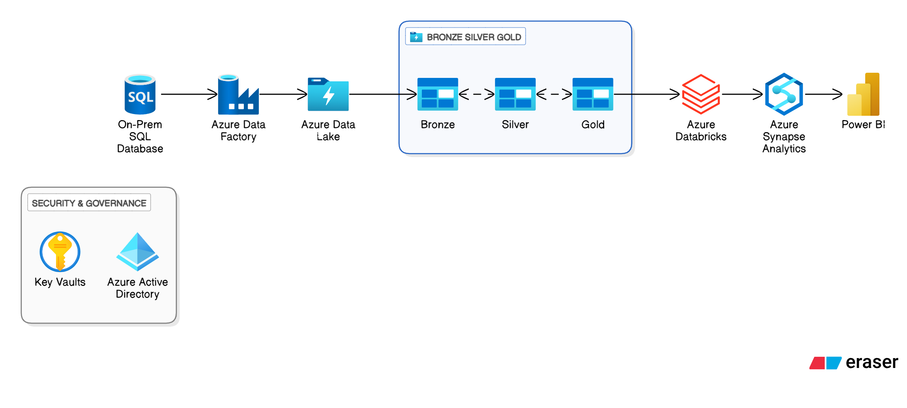

# 🧠 Data Flow: From Raw Data to Insights

This is a picture of how data travels from where it lives to where we can see and understand it. Let’s break it down step by step.

---

## 🏢 1. On-Prem SQL Database
This is where our data starts. It’s like a computer inside a company that stores information (like sales, customers, or orders).

---

## ⚙️ 2. Azure Data Factory
Think of this as a robot that moves data.  
It picks up data from the on-prem database and sends it to the cloud (Azure). It also makes sure the data arrives safely and on time.

---

## 💧 3. Azure Data Lake
This is a giant storage space in the cloud.  
It holds all our data in three layers:
- **Bronze:** Raw data — just as it comes in.  
- **Silver:** Cleaned-up data — easier to read and use.  
- **Gold:** Perfect data — ready for reports and analysis.

---

## 🔥 4. Azure Databricks
This is where smart data scientists and engineers work with the data.  
They use code to clean, join, and prepare it for deeper insights.  
You can think of it as the “data kitchen,” where raw ingredients (data) become a meal (usable information).

---

## 📊 5. Azure Synapse Analytics
This is the data brain.  
It helps run big data queries, combine datasets, and get results quickly.  
It’s also where the data from the Gold layer lives when it’s ready to be explored.

---

## 📈 6. Power BI
This is where everything comes to life visually.  
Power BI takes the clean, ready data from Synapse and turns it into charts, dashboards, and reports — easy for anyone to understand.

---

## 🔐 7. Security & Governance
Two key tools make sure everything is safe:
- **Azure Active Directory (AAD):** Controls who can log in and what they can see.  
- **Key Vaults:** Keeps passwords, secrets, and keys locked away safely.

---

## 🚀 Summary
Here’s how the pieces work together:
1. Data starts in the **on-prem database**.  
2. **Azure Data Factory** moves it into **Azure Data Lake**.  
3. It’s cleaned and processed in **Databricks**.  
4. Stored and analyzed in **Synapse Analytics**.  
5. Visualized in **Power BI** for business insights.  
6. Protected by **Azure AD** and **Key Vault**.
